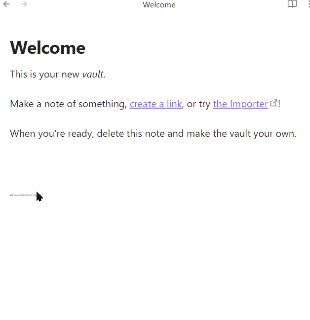
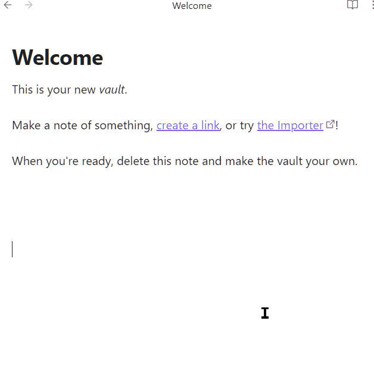

# Support

**Display images with `` tags.**

1. No impact on the original file.
2. Display `` images while scrolling.
3. Show `` images after modifying the file.

## ReadView

## LiveView

# The modification function of the interface comes from :

## ❤️❤️❤️

## [talengu/obsidian-local-img-plugin： 显示本地镜像 (github.com)](https://github.com/talengu/obsidian-local-img-plugin)

## [How to display local images with -tag and keep portability? - Help - Obsidian Forum](https://forum.obsidian.md/t/how-to-display-local-images-with-img-tag-and-keep-portability/37270)

## ❤️❤️❤️

